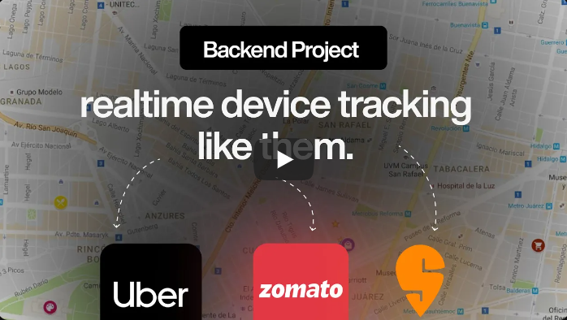
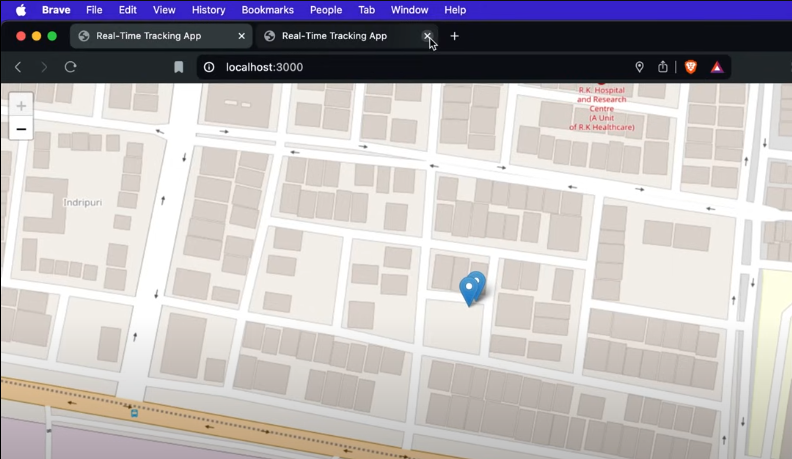
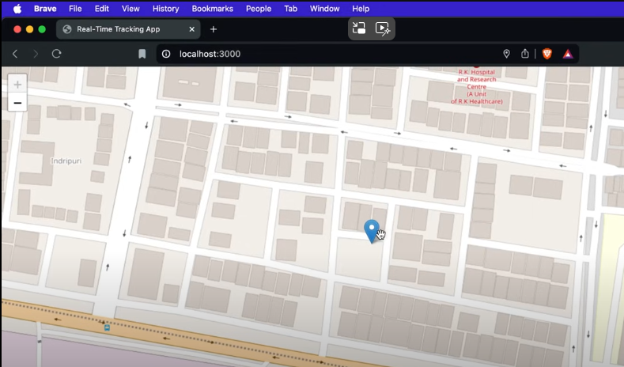

# Realtime-Tracking-Application-WebAPP
  🚀 **Real-Time Location Tracker**   Track user locations seamlessly from one place to another.   Ideal for apps like Ola, Uber, Zomato, and Swiggy.   📍 Accurate real-time updates with optimized routing.   🔗 Ready for integration into various location-based services.  ---   This should capture the key points concisely!

Here's how you can write the steps for your GitHub repository:

---

### Setup Instructions 🛠️

Follow these steps to set up the project locally:

1. **Initialize the Project**  
   Open your terminal in Visual Studio Code and run the following command to initialize a new Node.js project:
   ```bash
   npm init -y
   ```

2. **Install Required Packages**  
   Install the necessary packages for your project:
  
  Here’s an updated description with a gallery section added:

---

## 🚀 Real-Time Location Tracker

### Overview 🌍
This project is a real-time location tracking system designed to track users' movements from one location to another. It's ideal for applications similar to those used by Ola, Uber, Zomato, Swiggy, and other services that require precise and efficient location tracking. The system provides accurate real-time updates and optimized routing, making it highly effective for location-based services.

### Features ✨
- **Real-Time Tracking:** Continuously monitor user locations with high accuracy.
- **Optimized Routing:** Calculate the best routes in real-time to ensure efficiency.
- **Scalability:** Designed to handle multiple users simultaneously, making it suitable for large-scale applications.
- **Integration Ready:** Easily integrate with other services like map APIs, payment gateways, etc.

### How It Works 🛠️
The Real-Time Location Tracker works by leveraging Node.js with Express, EJS (Embedded JavaScript), and Socket.io to create a server that tracks the user's location in real-time and updates it across the connected clients. Here's how it works:

1. **Server-Side:** The backend server is built using Node.js and Express. It handles incoming requests and serves the necessary HTML, CSS, and JavaScript files to the client.
2. **Real-Time Communication:** Socket.io is used for real-time, bidirectional communication between the server and clients. As the user moves, their location is continuously updated and broadcasted to all connected clients.
3. **Rendering Views:** EJS is used to render dynamic HTML pages, making it easy to display real-time data to users.
4. **Tracking & Updates:** The tracker constantly monitors the user’s location and updates it on the map, which can be displayed in a web interface.

### Setup Instructions 🛠️

Follow these steps to set up the project locally:

1. **Initialize the Project**  
   Open your terminal in Visual Studio Code and run the following command to initialize a new Node.js project:
   ```bash
   npm init -y
   ```

2. **Install Required Packages**  
   Install the necessary packages for your project:
   ```bash
   npm i express ejs
   npm i socket.io
   ```

3. **Start Developing**  
   You're all set! Begin coding your real-time location tracker using Express, EJS, and Socket.io.

### Getting Started ⚙️
To get started with the project:

1. Clone the repository:
   ```bash
   git clone https://github.com/yourusername/repository-name.git
   ```

2. Navigate to the project directory:
   ```bash
   cd repository-name
   ```

3. Install dependencies:
   ```bash
   npm install
   ```

4. Start the server:
   ```bash
   npm start
   ```

5. Open your browser and go to `http://localhost:3000` to view the real-time tracker in action.

### Gallery 🖼️

Take a look at the project in action! Here are some screenshots and visual examples of how the Real-Time Location Tracker works:

- **Dashboard View:**  
  
  
- **Real-Time Map:**  
  
  
- **User Tracking:**  
  

*Note: Replace the paths above with actual image URLs or paths in your repository.*

### Usage 🚗
This real-time location tracker can be used in various scenarios, including:

- **Ride-Sharing Apps:** Track the movement of drivers and passengers.
- **Food Delivery Apps:** Monitor delivery personnel in real-time.
- **Logistics:** Track the movement of goods and vehicles.

### Contributions 🤝
Feel free to fork this repository, submit issues, and send pull requests. Contributions are always welcome!

---

This description now includes a "Gallery" section, allowing you to showcase screenshots or other visual elements that demonstrate your project's functionality. Be sure to add the actual image files or URLs when you upload the repository.

